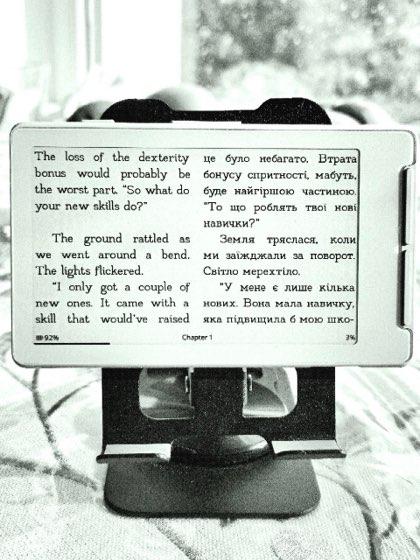
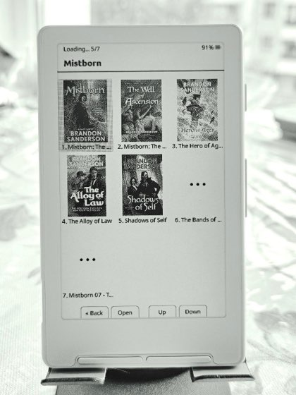
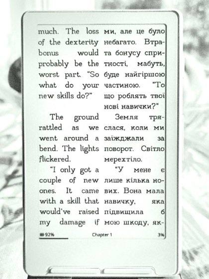
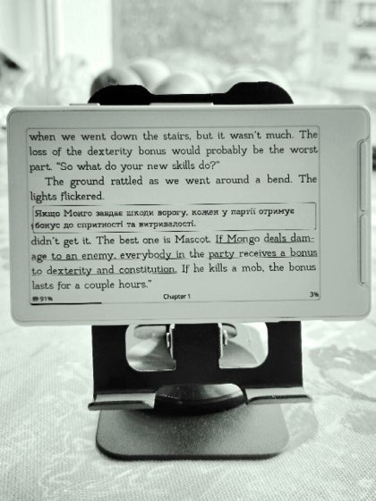
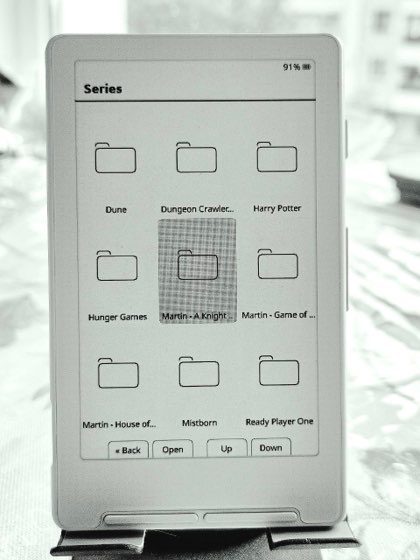
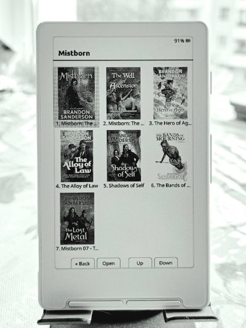

# CrossLingua Reader

> **A bilingual-first fork of [CrossPoint Reader](https://github.com/crosspoint-reader/crosspoint-reader).**
> Read in two languages without turning an e-reader into a phone.

CrossLingua keeps the capable, open-source CrossPoint reading experience and
builds a complete bilingual workflow around it: translate an EPUB directly on
the device or prepare it with the
[Ebook Translator Calibre plugin](https://github.com/bookfere/Ebook-Translator-Calibre-Plugin),
then choose how much of each language you want to see.

**Runs on:** ESP32-C3-based Xteink [X4](https://www.xteink.com/products/xteink-x4)
and [X3](https://www.xteink.com/products/xteink-x3).

<table>
  <tr>
    <td align="center" width="33%">
      <br/>
      <strong>Interlinear</strong><br/>
      <sub>Translation follows the source line by line.</sub>
    </td>
    <td align="center" width="33%">
      <br/>
      <strong>Side by Side</strong><br/>
      <sub>Two languages, aligned in parallel columns.</sub>
    </td>
    <td align="center" width="33%">
      <br/>
      <strong>Bookshelf</strong><br/>
      <sub>Browse books visually by their covers.</sub>
    </td>
  </tr>
</table>

## What makes CrossLingua different?

## Lingua: bilingual reading built into the reader

Lingua can translate the current chapter or an entire EPUB over Wi-Fi. The
result is cached on the SD card, so after translation the book can be read
offline and its display mode can be changed without sending the text again.
The original EPUB is never modified.

CrossLingua also recognizes translations embedded in an EPUB as
language-tagged paragraphs. That makes the same reading modes available for
bilingual books prepared outside the device, including books produced with the
[Ebook Translator Calibre plugin](https://github.com/bookfere/Ebook-Translator-Calibre-Plugin).

### Two translation workflows

- **On the device:** choose the source and target languages, translate one
  chapter or the whole book, and keep the generated bilingual copy in the
  book's SD-card cache. A single chapter usually takes **1–3 minutes**. A full
  book usually takes **10–30 minutes**. Actual time depends on your Wi-Fi
  connection, translation-engine availability, the amount of text, and similar
  conditions.
- **With Calibre:** prepare a bilingual EPUB with the
  [Ebook Translator plugin](https://github.com/bookfere/Ebook-Translator-Calibre-Plugin)
  and transfer it to the reader. CrossLingua detects its language-tagged
  translation paragraphs and applies the same Lingua modes without translating
  the book again.

### Translation engines

| Engine | API key | Notes |
|---|---:|---|
| **Google v2** | No | Default free Google backend |
| **Google v1 / HTML** | No | Free Google backend with HTML-aware requests |
| **Google legacy** | No | Compatibility option for older settings; currently routed through Google v2 |
| **Azure** | No | Keyless Microsoft Edge translation endpoint |
| **DeepL** | Yes | DeepL API Free |
| **DeepL Pro** | Yes | DeepL paid API |
| **OpenAI** | Yes | Chat Completions translation |
| **DeepSeek** | Yes | DeepSeek chat translation |
| **Gemini** | Yes | Google Gemini translation |

> Free, undocumented translation endpoints may be rate-limited, changed, or
> withdrawn by their providers. Text is sent to the selected provider only
> while a translation is being created.

## Eight ways to read

The same translated book can be viewed in any of these modes. Mode-specific
options appear directly below the active mode in the **Lingua** menu.

### Interlinear

Compact translation annotations sit above the source lines they belong to.
This keeps both languages in one reading flow without duplicating full
paragraph blocks. The annotation colour can be set to **Black**, **Grey**, or
**Light Grey**.

<p align="center">
  
</p>

### Side by Side

The source and translation are laid out as synchronized left and right
columns. Only the translation column's colour is configurable: **Black**,
**Grey**, or **Light Grey**. It works in both landscape and portrait
orientations.

<table>
  <tr>
    <td align="center">
      
    </td>
    <td align="center">
      
    </td>
  </tr>
</table>

### Interleaved

Original and translated paragraphs alternate in the normal page flow.
Translations can use **Dimmed** or **Dimmed Light** ink and either the
**Same** or a **Smaller** text size.

### Tooltip

Read the uncluttered original page and reveal one sentence translation at a
time in a small overlay. Choose the **front** or **side** button pair for
sentence stepping, choose whether the control **loops on the page** or
**turns the page and continues**, and set translation text to the **Same** or
a **Smaller** size.

<table>
  <tr>
    <td align="center">
      <br/>
      <sub>Tooltip in landscape orientation.</sub>
    </td>
    <td align="center">
      <br/>
      <sub>Tooltip in portrait orientation.</sub>
    </td>
  </tr>
</table>

### Page Translation

Keep the original page visible and open a larger translation overlay for the
text on that page. Choose the **front** or **side** buttons for the overlay
controls and use the **Same** or a **Smaller** translation size.

### Original Only

Show only the source-language text. This is useful for immersion reading
while keeping translations available for a quick switch to Tooltip or Page
Translation.

### Translation Only

Show only the translated text as a clean monolingual book.

### Normal

Render the source and translation together in the EPUB's normal flow, using
the same text colour. This is the neutral compatibility mode for already
bilingual EPUBs.

## Bookshelf with cover previews

**Bookshelf** is a visual alternative to the file browser. It renders a 3×3
grid, generates and caches EPUB cover thumbnails in the background, preserves
folder navigation, and lets you open a book directly from its cover.

<table>
  <tr>
    <td align="center" width="33%">
      <br/>
      <sub>Organize the library into series and folders.</sub>
    </td>
    <td align="center" width="33%">
      <br/>
      <sub>Browse a complete series by its covers.</sub>
    </td>
    <td align="center" width="33%">
      <br/>
      <sub>Cover previews are generated and cached in the background.</sub>
    </td>
  </tr>
</table>

## A custom font made for CrossLingua

We developed **EdsLab**, a custom reading font created specifically for
CrossLingua and comfortable bilingual reading on an e-ink screen. It is the
default font, but you are not locked into it: custom `.cpfont` families can
still be installed from the SD card. See
[Custom SD-card fonts](./docs/sd-card-fonts.md).

## Everything inherited from CrossPoint

CrossLingua remains a full CrossPoint Reader fork, not a translation-only
experiment. It includes EPUB 2/3 rendering, `.xtc/.xtch`, `.txt` and `.bmp`
support, images, embedded styles, hyphenation, kerning, footnotes, bookmarks,
StarDict dictionaries, chapter navigation, go-to-percent, focus reading,
auto page turn, orientation control, screenshots, custom fonts, themes,
button remapping, KOReader progress sync, OPDS, WebDAV, Calibre wireless
transfer, a web file manager and settings UI, EPUB optimization, OTA updates,
24 UI languages and RTL support.

## Roadmap

CrossLingua is actively evolving. This section will track the next Lingua
modes, translation workflows, library improvements, and device support as
they are planned.

- [ ] Roadmap details coming soon

---

## USB-locked devices (Xteink Unlocker)

Some Xteink units purchased from third-party stores (e.g. AliExpress) ship with
USB flashing locked from the factory. If your device is locked, use the Xteink
Unlocker at https://crosspointreader.com/#unlock-tool before flashing.

**You do not need this tool if you bought your device directly from xteink.com.** Those units are not locked.

**Not sure if your device is locked?** Power it on, connect the USB-C cable, and try flashing via the web flasher first (see
[Install firmware](#install-firmware) below). If the browser's serial device picker does not show your device, try a different
USB port or browser before assuming the device is locked. Only reach for the unlocker if the device still doesn't appear.

## Install firmware

### Web installer (recommended)

1. Connect your device to your computer via USB-C and wake/unlock the device
2. Download a `firmware.bin` from the
   [CrossLingua releases page](https://github.com/ed-fruty/crosslingua-reader/releases).
3. Open https://crosspointreader.com/#flash-tools, select X3 or X4, choose
   **Custom .bin**, and upload the downloaded firmware.

### Web installer (specific version)

1. Connect your device to your computer via USB-C and wake/unlock the device
2. Download a `firmware.bin` from
   [CrossLingua Releases](https://github.com/ed-fruty/crosslingua-reader/releases),
   a local build, or a continuous integration artifact.
3. Go to https://crosspointreader.com/#flash-tools, select device (X3 or X4), click "Custom .bin" and upload a `firmware.bin`.

### Revert to Official Firmware

To revert to the official firmware, you can also flash the latest official firmware using https://crosspointreader.com/#flash-tools.

### Command line

1. Install [`esptool`](https://github.com/espressif/esptool):

```bash
pip install esptool
```

2. Download `firmware.bin` from the
   [CrossLingua releases page](https://github.com/ed-fruty/crosslingua-reader/releases).
3. Connect your device via USB-C.
4. Find the device port. On Linux, run `dmesg` after connecting. On macOS:

```bash
log stream --predicate 'subsystem == "com.apple.iokit"' --info
```

5. Flash:

```bash
esptool.py --chip esp32c3 --port /dev/ttyACM0 --baud 921600 write_flash 0x10000 /path/to/firmware.bin
```

Adjust `/dev/ttyACM0` to match your system.

### Manual

See [Development quick start](#development-quick-start) below.

---

## Custom SD-card fonts

Convert your own TTF/OTF files into `.cpfont` files that load from the SD card. No firmware reflash is needed.

1. Go to https://crosspointreader.com/fonts and open the "SD-card font builder" form.
2. Upload up to four styles (regular, bold, italic, bold-italic), set the family name, point sizes, and Unicode range.
3. Download the generated `.cpfont` files.
4. Copy them to your SD card under `/fonts/YourFont/` (or `/.fonts/YourFont/` to hide the folder).
5. Select the font on the device from the font settings.

Conversion runs the firmware repo's `lib/EpdFont/scripts/fontconvert_sdcard.py` script unmodified, so output matches a local host build.

---

## Documentation

- [User Guide](./USER_GUIDE.md)
- [Web server usage](./docs/webserver.md)
- [Web server endpoints](./docs/webserver-endpoints.md)
- [Project scope](./SCOPE.md)
- [Contributing docs](./docs/contributing/README.md)
- [Touch and UI development](./docs/contributing/touch-and-ui.md) - FreeInkUI components for new screens, the touch bridge for existing ones, and build envs for the non-Xteink touch devices

---

## Development quick start

### Prerequisites

- [pioarduino](https://github.com/pioarduino/pioarduino) or VS Code + pioarduino plugin
- Python 3.8+
- `clang-format` 21
- USB-C cable supporting data transfer

### Setup

```bash
git clone --recursive https://github.com/ed-fruty/crosslingua-reader
cd crosslingua-reader

# if cloned without --recursive:
git submodule update --init --recursive
```

### Nix/NixOS

Nix/NixOS users can enter the development shell with either `nix develop` (flakes) or `nix-shell`:

```bash
nix develop -f nix
# or
nix-shell nix
```

To flash a connected ESP32-C3 device, enable PlatformIO's udev rules in your NixOS configuration:

```nix
services.udev.packages = with pkgs; [ platformio-core.udev ];
```

After rebuilding the system configuration, reconnect the device or reload udev rules.

### Build / flash / monitor

```bash
pio run --target upload
```

### Contributor pre-PR checks

```bash
./bin/clang-format-fix
pio check -e default
pio run -e default
```

### Debugging

After flashing the new features, it’s recommended to capture detailed logs from the serial port.

First, make sure all required Python packages are installed:

```python
python3 -m pip install pyserial colorama matplotlib
```

After that run the script:

```sh
# For Linux
# This was tested on Debian and should work on most Linux systems.
python3 scripts/debugging_monitor.py

# For macOS
python3 scripts/debugging_monitor.py /dev/cu.usbmodem2101
```

Minor adjustments may be required for Windows.

---

## Internals

CrossLingua is pretty aggressive about caching data down to the SD card to
minimise RAM usage. The ESP32-C3 only has ~380KB of usable RAM, so we have to
be careful. A lot of the decisions made in the design of the firmware were
based on this constraint.

### Data caching

The first time chapters of a book are loaded, they are cached to the SD card. Subsequent loads are served from the
cache. This cache directory exists at `.crosspoint` on the SD card. The structure is as follows:

```text
.crosspoint/
├── epub_<hash>/         # one directory per book, named by content hash
│   ├── progress.bin     # reading position (chapter, page, etc.)
│   ├── cover.bmp        # generated cover image
│   ├── book.bin         # metadata: title, author, spine, TOC
│   ├── css_rules.cache  # parsed CSS rule cache
│   ├── img_*            # rendered image cache files
│   └── sections/        # per-chapter layout cache
│       ├── 0.bin
│       ├── 1.bin
│       └── ...
├── settings.json        # device settings
├── state.json           # resume/runtime state
└── recent.json          # recent books list
```

Removing `/.crosspoint` clears all cached metadata and forces a full regeneration on next open. Book deletes, overwrites, and moves done through the firmware or web UI clear or re-key matching caches; manual SD-card edits may leave stale cache directories behind.

For more details on the internal file structures, see the [file formats document](./docs/file-formats.md).

---

## Contributing

Contributions are welcome. If you're new to the codebase, start with the
[contributing docs](./docs/contributing/README.md). For upstream CrossPoint
work, see its [ideas discussion board](https://github.com/crosspoint-reader/crosspoint-reader/discussions/categories/ideas).

Everyone here is a volunteer, so please be respectful and patient. For governance and community expectations, see [GOVERNANCE.md](./GOVERNANCE.md).

---

CrossLingua Reader is **not affiliated with Xteink or any device manufacturer**.

Huge shoutout to [diy-esp32-epub-reader](https://github.com/atomic14/diy-esp32-epub-reader), which inspired this project.
